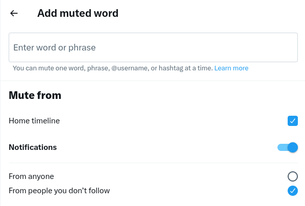
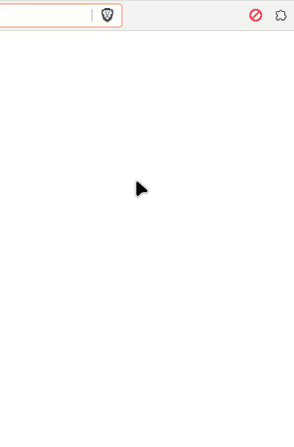
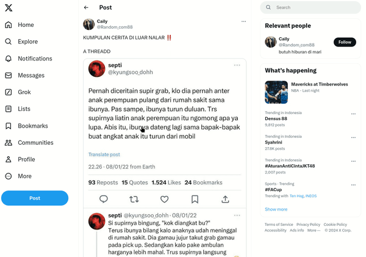

# X.com Block Keywords Extensions

## Background

X.com (also known as Twitter) is one of the most used social media in the world.

However, some content can be annoying for some people.

This content can be affiliate links, bad words, etc.

This extension was created to protect us from that tweet/post.

### Mute Word on X

X.com actually already have a mute word feature, but it's still limited and cannot detect links (in case you want to block tweets that contain affiliate links).

This feature is limited to words, phrases, @username, and hashtags. In other words, this extension is the brutal version.

## Example Use Case

Block affiliate links that contain word `shope`.

Shope is one of Marketplace similar to Amazon/Ebay.

**Set keyword**

**This is before Using The Extension**

**This is after Using the Extension**

## Features

- Block Keywords
- Block Ads (Limited)
